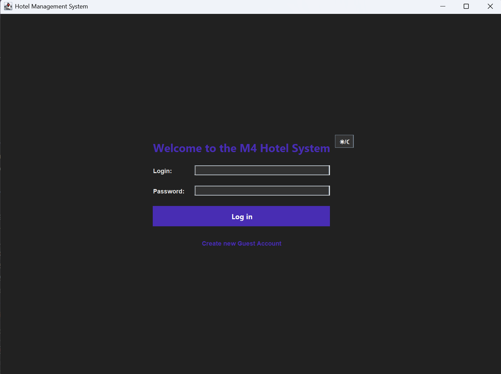
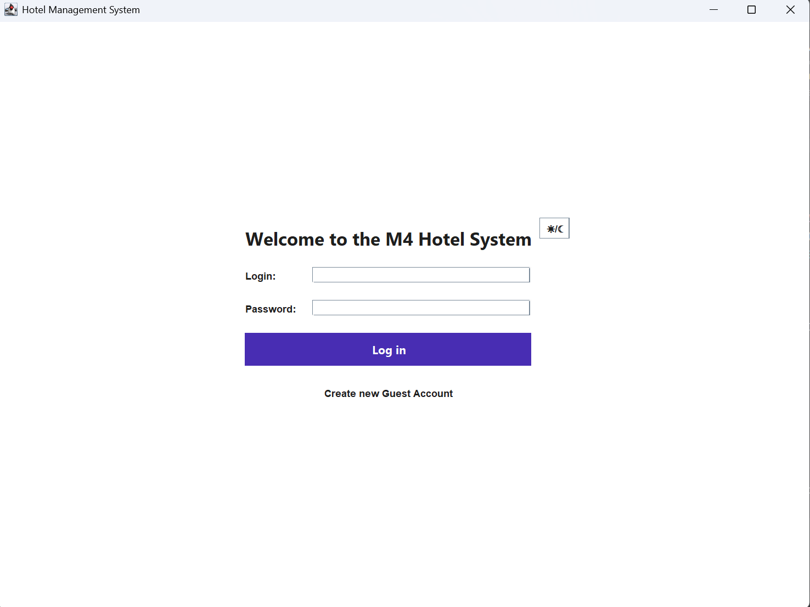
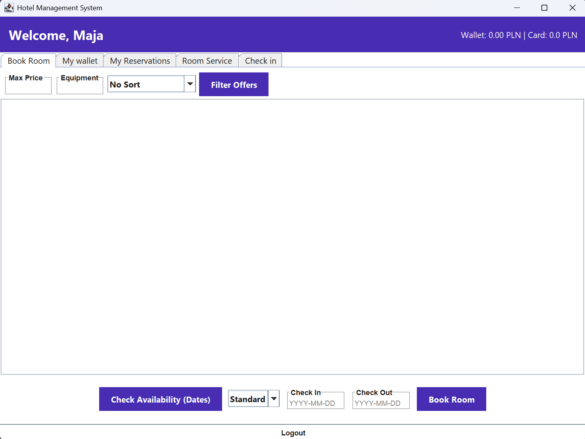
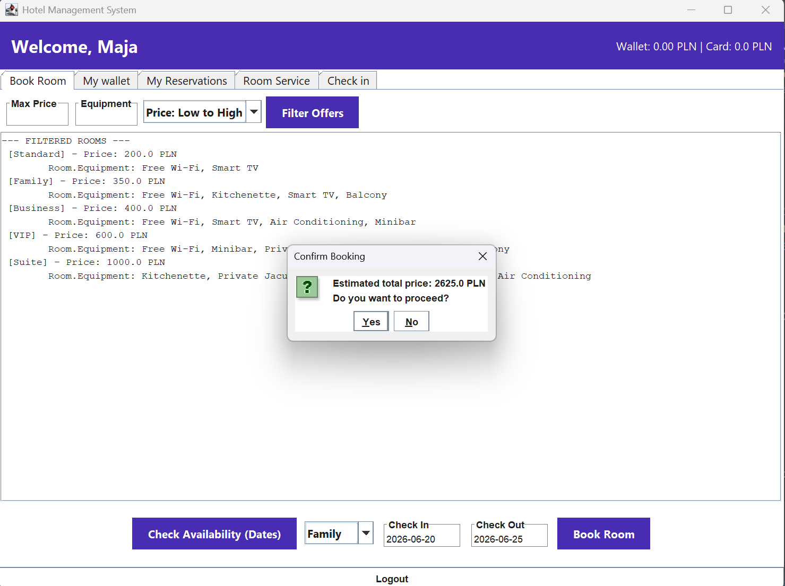
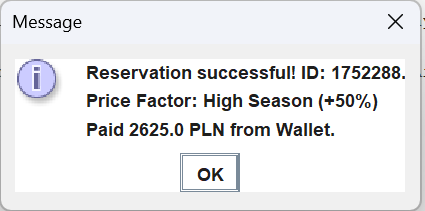
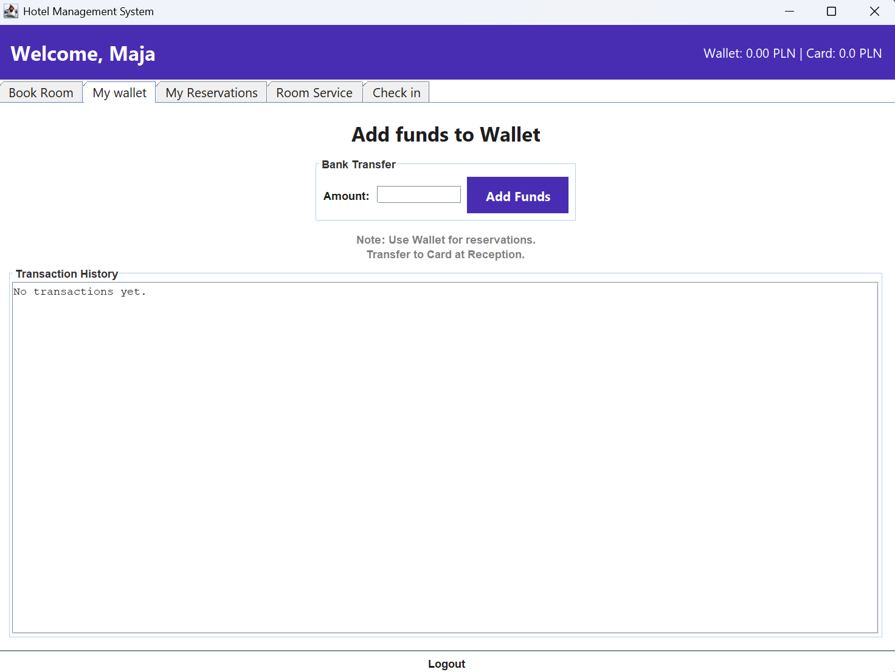
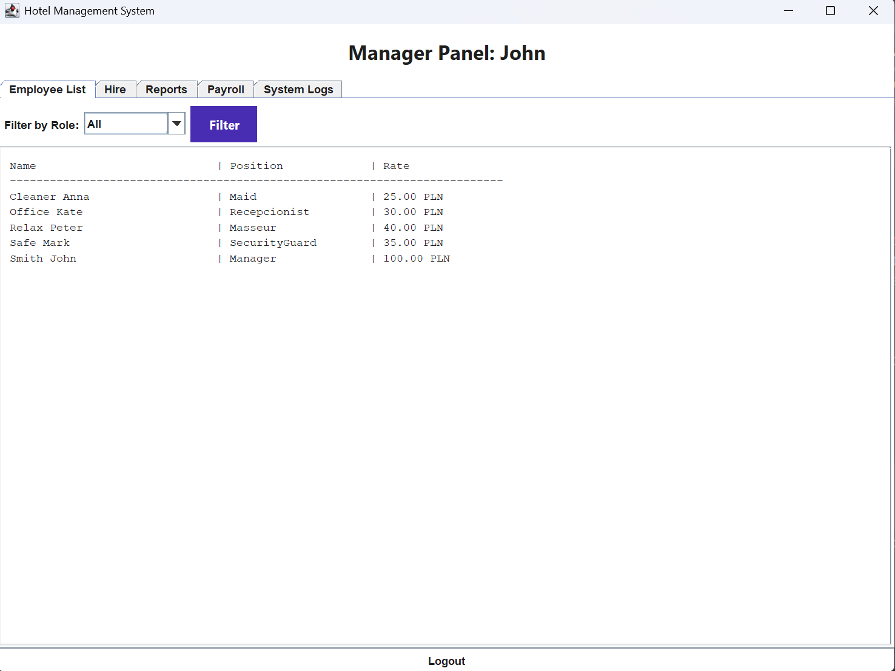
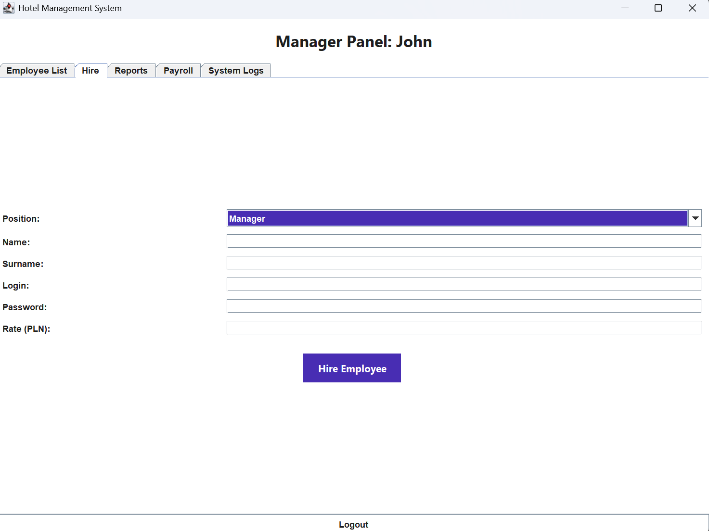
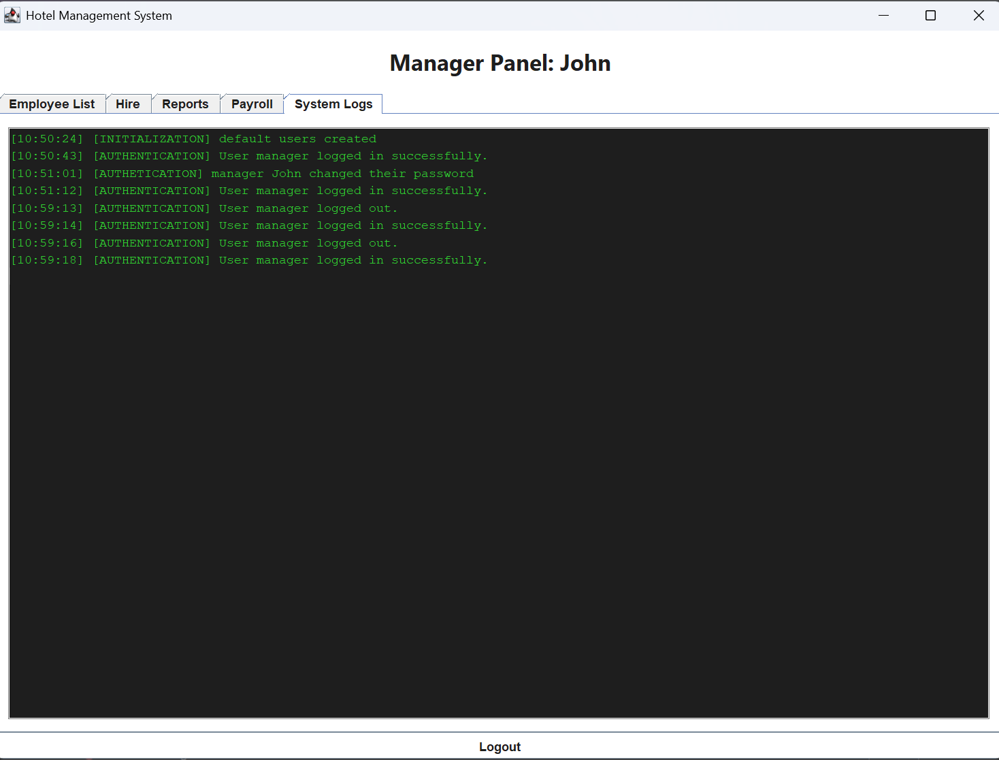

# hotel-managment-system

A desktop Enterprise Resource Planning (ERP) platform for hotel operations built in Java. The system features separate, state-synchronized dashboards for **Managers, Receptionists, Housekeeping, Spa Staff, Security, and Guests** built on an asynchronous, data-driven architecture.

---

## UI Theme Engine (Dynamic Light & Dark Modes)

The UI utilizes a custom programmatic theme manager that updates color vectors across all active view frames dynamically at runtime without requiring application re-instantiation or frame rebuilding.

| Dark Theme Workspace | Light Theme Workspace |
|---|---|
|  |  |

---

## Role-Based Access Control (RBAC) & Workflows

Users log in through a centralized gateway and are dynamically served tailored dashboards depending on their security contract and system role.

### 1. Guest Self-Service Portal
Guests gain access to an integrated suite allowing autonomous reservation handling, financial ledger auditing, and digital amenity keys.

* **Dashboard Landing:** Direct tracking of active stays, checkout timelines, and profile data.
  

* **Autonomous Room Booking:** Filterable reservation module parsing room sizes, premium designations, and custom calendar dates.
  
  

* **Integrated FinTech & Digital Keys:** A secure wallet application tier enabling bank-to-wallet funds transfers and room card topping-up.
  

### 2. Administrative & Corporate Workspace
Management modules feature global overrides to manage personnel rosters, review employee parameters, and dynamically onboard staff into security hierarchies.

* **Live Roster Audit:** Real-time visibility into employee metrics, active shift classifications, and specific salary indices.
  

* **Secure Employee Onboarding:** A system gateway that validates inputs and securely scales the hotel workforce infrastructure.
  

---

## Deep-Dive Architecture & Design Patterns

### The Observer Pattern
The application engine detaches state modifications from direct visual updates. Interface modules register as `DataObserver` targets. Any backend state variation automatically broadcasts updates to trigger localized graphical re-renders. 
* **Real-Time System Logger:** Implements an automated audit trail viewer (`HotelLogger`) tracking background tasks, reservation commits, and security events.



### Transactional State Persistence (Serialization)
To prevent runtime data decay without deploying an external database engine, the core database layer relies on **Java Object Serialization (`.ser`)**. 
* Abstracted object graphs tracking users, structural room objects, active queues, and historical bookings are read dynamically upon execution and written atomically following state modifications.
* Provides transactional boundaries to protect financial states against system-kill interruptions.

### The Strategy Pattern
Room entities leverage the **Strategy Pattern** to separate raw object metrics from pricing logic computations:
* Decouples raw entities from environmental formulas (e.g., peak seasonal shifts, corporate contract discounts, multi-day long-stay rate scaling).
* Allows alternative algorithmic rate multipliers to drop into runtime routines seamlessly.

### Defensive Programming & Validation
* **Custom Security Rules:** Features a comprehensive input validation framework, including a dedicated `WeakPasswordException` layer to enforce enterprise-grade security protocols during onboarding.
* **Financial Integrity Invariants:** All accounting routines utilize structural logic guards to prevent data anomalies (e.g., negative financial injection bounds or overdraft conditions).

---

## Getting Started

### 1. Database Initialization (Data Seeding)
Before initializing the system frame for the first time, run the automated seeding engine to build the serialized data layers:
```bash
javac DataGenerator.java
